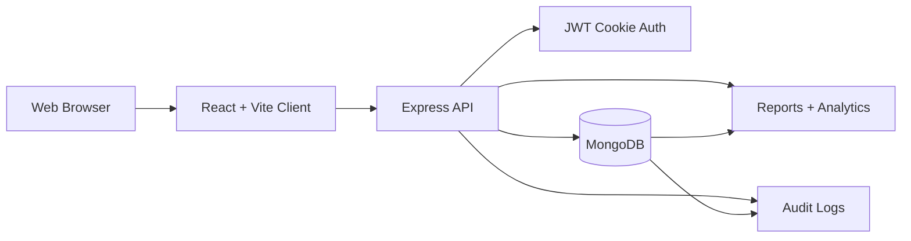

# Architecture

## Stack

- Client: React, Vite, Tailwind utility classes, lucide icons.
- Server: Express, JWT cookie authentication, Mongoose.
- Database: MongoDB.
- Reporting: CSV exports plus JSON summary, completion, escalation, and analytics endpoints.

## Role Journeys

- Employee: create draft goals, edit before submission, submit at 100% total weightage, log achievements and check-ins.
- Manager: review team goals, edit target/weightage before approval, return for rework, review check-ins, view team reports.
- Admin/HR: configure cycles, maintain hierarchy, view organization reports, unlock locked goals, inspect audit history.
